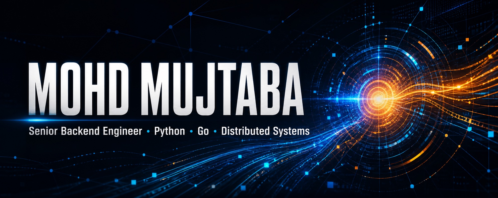

  

<h1 align="center">Mohd Mujtaba</h1>

<b>Senior Backend Engineer (SDE-3) · Python · Go · Fintech & Distributed Systems</b>

  
  
  

  
  
  
  

## 👤 Who am I?

I'm **Mohd Mujtaba**, a Senior Backend Engineer at **Wealthy**. I build high-throughput fintech and distributed systems in **Python** and **Go** — the kind where correctness, reliability and recovery are product features.

My work spans mutual-fund infrastructure, payment orchestration, financial data pipelines, AI platforms and the architecture that keeps all of them dependable in production.

> [!IMPORTANT]
> I enjoy turning complex transaction lifecycles into boringly reliable systems — and helping engineering teams ship them safely.

## ⚡ Production impact

<table>
  <tr>
    <td align="center" width="25%">
      <h2>70×</h2>
      <b>AUM growth supported</b> 
      INR 50 Cr → INR 3,500 Cr
    </td>
    <td align="center" width="25%">
      <h2>500k+</h2>
      <b>Payments / month</b> 
      Multi-gateway orchestration
    </td>
    <td align="center" width="25%">
      <h2>10M+</h2>
      <b>Records / day</b> 
      Financial data pipelines
    </td>
    <td align="center" width="25%">
      <h2>6+</h2>
      <b>Years building</b> 
      Production backend systems
    </td>
  </tr>
</table>

## 🛰️ Current mission

As an **SDE-3 at Wealthy**, I'm currently driving architecture and production-readiness across Python and Go services:

| System | What I'm building |
|---|---|
| **Notification Platform** | Multi-channel delivery across email, SMS, WhatsApp and push with routing, idempotency, rate limits and delivery tracking |
| **RTA Reporting Platform** | Asynchronous CAMS and KFintech reporting with slot-aligned batches, feed generation, retriggers, fallbacks and operations APIs |
| **Transaction Recovery** | Automation for RTA reversal/reposting, mirrored transactions, historical repair and investor-order safeguards |
| **MeetIQ** | Go backend for AI meeting intelligence with S3 uploads, SQS workers, retries/DLQs, Redis and regenerated client summaries |
| **Payment Reliability** | Server-to-server net banking, callback/status reconciliation, safe payload handling and contextual production logging |

## 🐉 Selected engineering sagas

<b>Mutual Fund Platform — 70× AUM growth</b>

 

- Owned backend delivery across SIPs, lump-sum investments, withdrawals, switches, broker changes, ARN transfers and portfolio operations.
- Built and maintained CAMS/Karvy feed and reverse-feed workflows with distributed locking and operational reconciliation.
- Supported growth to **INR 3,500 Cr AUM**, **INR 300 Cr monthly inflows** and **INR 30 Cr monthly SIP value**.

<b>Payment Platform — 500k+ transactions/month</b>

 

- Architected a multi-tenant service in **Go + Gin**.
- Integrated Razorpay, Cashfree, HDFC, Pine Labs and CAMSPay.
- Supported UPI Collect/Intent, net banking, e-mandates, signed callbacks and status reconciliation.

<b>Revenue Calculation Engine — 10M+ records/day</b>

 

- Designed a distributed engine processing **1M+ financial transactions/day**.
- Computes revenue from portfolio valuations across multiple financial products.
- Built for high-volume execution, observability and safe recovery.

<b>AI Platforms — from hackathon to production</b>

 

- Built the Go/Gin backend for **MeetIQ**, an AI meeting-intelligence product.
- Built an agent that automated support-ticket analysis, query resolution and internal task execution.
- Worked with **Google ADK, MCP, GenAI Toolbox and Whisper**.

## 🧰 Engineering arsenal

**Languages**

**Backend & APIs**

**Data & Infrastructure**

**Also:** Gin · Flask · REST · GraphQL · gRPC · ClickHouse · SQLAlchemy · GORM · Kubernetes · Celery · Google ADK · MCP · Whisper

## 🌱 Open source

### [MCP Toolbox for Databases](https://github.com/googleapis/mcp-toolbox)

Contributed to the Google open-source project formerly known as Gen AI Toolbox for Databases:

- [PR #760 — support multiple YAML configuration files](https://github.com/googleapis/mcp-toolbox/pull/760)
- [PR #641 — handle MySQL NULL string values](https://github.com/googleapis/mcp-toolbox/pull/641)

## 🪐 Selected project

### AstraFolio × MF Central

A mutual-fund portfolio analytics platform with MF Central authentication, secure token handling, SIP/STP/SWP insights, reports, charts and portfolio actions.

## 🏆 Signal unlocked

| Award | Result | What happened next |
|---|---:|---|
| **MeetIQ — Hackathon 2.0** | 🥇 1st | The offline-first meeting-intelligence prototype was productionized into an internal platform |
| **NudgeIO — Hackathon 1.0** | 🥈 2nd | Generated actionable partner opportunities from user activity and financial signals |

<b>Background</b>

 

**B.Tech. in Computer Science** · Lovely Professional University · GPA 8.95 · 2016–2020

## 🧭 How I build

<pre>
Correctness first  →  explicit states  →  idempotent operations
Observability      →  contextual logs  →  fast recovery
Scale              →  async systems    →  measured reliability
Leadership         →  clear decisions  →  safe production rollouts
</pre>

> “Backend systems are invisible — until they fail. I build them so they don't.”

### Have a hard backend problem?

[**Let's talk →**](mailto:mujtaba.aamir1@gmail.com)

Senior Backend Engineer · Python · Go · Distributed Systems · Fintech

